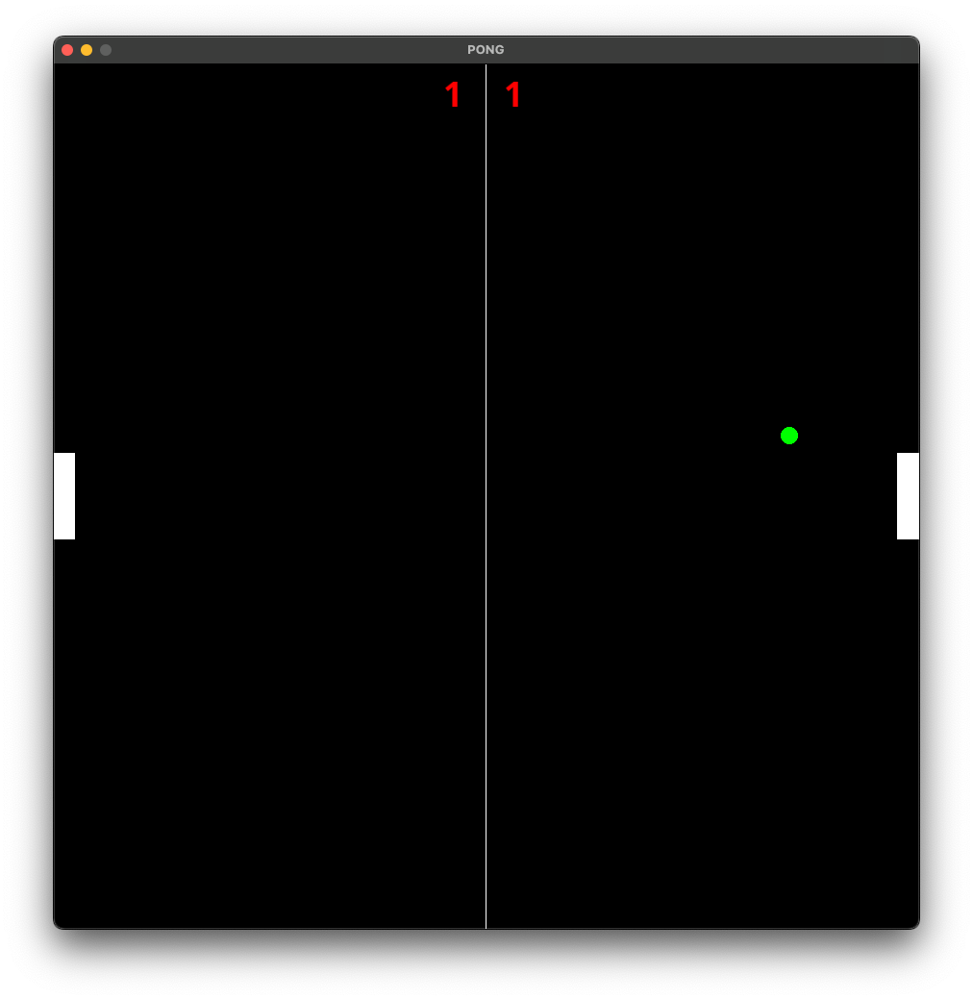

# Pong
A simple pong game that I created with OpenGL in C.

## Compiling and running the game 
### Mac
You might need to install the following libaries:
```shell
brew install libpng zlib harfbuzz brotli 
```
After that you should be able to run the game:
```shell
make mac #compile the game
build/pong #run the game
```

### Windows
```shell
make windows
build/pong
```